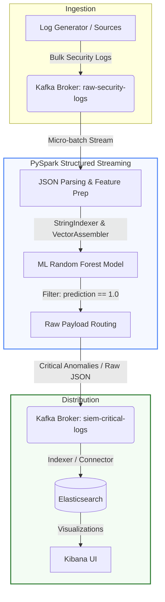

# AnomalyGate System Architecture Documentation

**AnomalyGate** is a real-time, ML-driven pre-ingestion security pipeline designed to act as an automated gatekeeper (or "tollbooth") for Security Information and Event Management (SIEM) systems. 

By filtering out benign background noise and forwarding only critical security anomalies, AnomalyGate enables organizations to reduce their SIEM data ingestion volumes by **85-90%**, yielding massive license and storage cost savings while maintaining near-zero latency threat detection.

---

## 1. System Architecture

Below is the high-level data flow diagram of the AnomalyGate pipeline, showing how logs are generated, streamed, classified, and visualized.



---

## 2. Ingestion & Log Traffic Profiles

To ensure model accuracy and simulate real-life environments, logs are generated based on distinct, overlapping activity profiles. This includes standard enterprise noise, successful attacks, undetected data exfiltration, and auth brute-force attempts.

### Log Profiles Matrix

| Activity Profile | Event Type | Action | Severity | Bytes Transferred | Target Classification |
| :--- | :--- | :--- | :--- | :--- | :--- |
| **Web Browsing** (Benign) | `Network Traffic` / `API Call` | `allowed` (95%) / `denied` (5%) | `low` | 200 - 8,000 B | **Benign** (`is_anomaly = 0`) |
| **User Login** (Benign) | `User Login` | `allowed` (85%) / `denied` (15%) | `low` (allowed) / `medium` (denied) | 50 - 300 B | **Benign** (`is_anomaly = 0`) |
| **System Check** (Benign) | `System Check` / `File Access` | `allowed` (99%) / `denied` (1%) | `low` | 1,000 - 25,000 B | **Benign** (`is_anomaly = 0`) |
| **SQL Injection** (Anomaly) | `API Call` / `SQL Injection Attempt` | `blocked` (70%) / `allowed` (30%) | `high` / `critical` | 15,000 - 85,000 B | **Anomaly** (`is_anomaly = 1`) |
| **Brute Force** (Anomaly) | `Failed Login` | `denied` (90%) / `allowed` (10%) | `high` | 100 - 1,200 B | **Anomaly** (`is_anomaly = 1`) |
| **Data Exfil** (Anomaly) | `File Access` | `allowed` | `high` | 500,000 - 10,000,000 B | **Anomaly** (`is_anomaly = 1`) |
| **Port Scan** (Anomaly) | `Port Scan` | `denied` (80%) / `blocked` (20%) | `medium` | 0 - 150 B | **Anomaly** (`is_anomaly = 1`) |

> [!NOTE]
> Unlike naive rulesets, this classification logic mimics real-world scenarios: for instance, a successful SQL Injection or Data Exfiltration is `allowed` by security gateways but is still flagged as a critical anomaly because of its event profile, payload size, and severity level.

---

## 3. Core Components

### A. Apache Kafka Message Broker
*   **Purpose:** Serves as the high-throughput, low-latency ingestion buffer.
*   **Topics:**
    1.  `raw-security-logs` (Source): Ingests the raw log streams from all endpoints, firewalls, and application servers.
    2.  `siem-critical-logs` (Sink): Receives only the validated anomalous events.
*   **Design Choice:** Kafka isolates the streaming analytics cluster (Spark) from the log sources, ensuring no data is lost during traffic spikes.

### B. PySpark Structured Streaming Pipeline
*   **Purpose:** Computes the machine learning inference in real-time.
*   **Operations:**
    1.  **Ingestion:** Reads Kafka stream in micro-batches using `startingOffsets` set to `earliest`.
    2.  **Parsing:** Evaluates the raw JSON input matching the schemas defined in [stream.py](file:///home/pi/Projects/AnomalyGate/src/pipeline/stream.py).
    3.  **Feature Prep:** Leverages a `PipelineModel` containing `StringIndexer` and `VectorAssembler` stages to turn text fields into numeric vectors.
    4.  **Classification:** Evaluates features using a trained `RandomForestClassifier`.
    5.  **Data Preservation:** Filters records where `prediction == 1.0` and sinks the **original raw JSON string** back to the output Kafka topic, preserving all fields (even those not in the ML parsing schema).

### C. Elasticsearch & Kibana visualization
*   **Purpose:** Indexes and visualizes the critical anomalies routed to the SIEM.
*   **Ports:** Elasticsearch is hosted on port `9200` and Kibana runs on port `5601`.
*   **Design Choice:** Serves as the storage and search dashboard for security analysts to examine raw security alerts.

---

## 4. Machine Learning & Feature Engineering

The system trains a Random Forest model on the bulk logs. The model processes the following features:
*   `event_type_idx` (categorical string representation of the source event type)
*   `action_idx` (categorical string representing allowed/denied/blocked status)
*   `severity_idx` (categorical string representation of the threat level)
*   `bytes_transferred` (numeric value representing payload size)

```python
# Feature assembler definition in train.py
assembler = VectorAssembler(
    inputCols=["event_type_idx", "action_idx", "severity_idx", "bytes_transferred"],
    outputCol="features"
)
```

The trained Random Forest classifier utilizes 20 trees with a depth of 5, providing stable predictions without overfitting on the categorical splits.

---

## 5. Operations Guide

### A. Quick Start Commands

To clean checkpoints, generate the bulk traffic logs, train the model, feed Kafka, and run a test query:

```bash
# 1. Clean checkpoints and temp data
make clean

# 2. Generate bulk real-life log dataset (10,000+ entries)
make generate

# 3. Train the Random Forest Model
make train

# 4. Feed logs into the raw-security-logs topic
make feed

# 5. Process stream in one-shot mode (exits when done)
make run-once

# 6. Verify outputs in the critical topic
make consume
```

### B. Dashboard Ports

*   **Spark UI Dashboard:** [http://localhost:4040](http://localhost:4040) (active while streaming queries run)
*   **Kibana UI Console:** [http://localhost:5601](http://localhost:5601) (running inside docker)
