# AnomalyGate System Architecture Documentation

**AnomalyGate** is a real-time, ML-driven pre-ingestion security pipeline designed to act as an automated gatekeeper for Security Information and Event Management (SIEM) systems. 

By filtering out benign background noise and forwarding only critical security anomalies, AnomalyGate enables organizations to reduce their SIEM data ingestion volumes by **85-90%**, yielding massive license and storage cost savings while maintaining near-zero latency threat detection.

---

## 1. System Architecture (Kubernetes Native)

Below is the high-level data flow diagram of the AnomalyGate pipeline, now fully orchestrated on Kubernetes with a centralized NGINX API Gateway.

```mermaid
graph LR
    subgraph Ingestion [Ingestion Layer]
        A([Log Sources]) -->|Bulk Logs| N{{"NGINX API Gateway"}}
        N -->|TCP 9092| B[("Kafka: raw-security-logs")]
    end
    
    subgraph Processing [PySpark ML Pipeline]
        B -->|10s Micro-batch| C("Metrics Aggregation")
        C --> D("VectorAssembler")
        D --> E{{"K-Means Clustering"}}
        E -->|Distance > Threshold| F("Inject Anomaly Score")
    end
    
    subgraph Storage [SIEM & Visualization]
        F -->|Critical Alerts| G[("Kafka: siem-critical-logs")]
        G -->|Logstash| H[("Elasticsearch")]
        H --> I(["Kibana Dashboard"])
        
        N -.->|HTTP 80| I
        N -.->|HTTP 9200| H
    end

    %% Beautiful custom styles
    classDef gateway fill:#f39c12,stroke:#e67e22,stroke-width:2px,color:#fff;
    classDef broker fill:#9b59b6,stroke:#8e44ad,stroke-width:2px,color:#fff;
    classDef ml fill:#3498db,stroke:#2980b9,stroke-width:2px,color:#fff;
    classDef db fill:#2ecc71,stroke:#27ae60,stroke-width:2px,color:#fff;
    classDef ui fill:#1abc9c,stroke:#16a085,stroke-width:2px,color:#fff;
    classDef process fill:#95a5a6,stroke:#7f8c8d,stroke-width:1px,color:#fff;

    class N gateway;
    class B,G broker;
    class E ml;
    class H db;
    class I ui;
    class C,D,F process;

    style Ingestion fill:#fdfefe,stroke:#bdc3c7,stroke-width:2px,stroke-dasharray: 5 5,rx:10,ry:10
    style Processing fill:#ebf5fb,stroke:#3498db,stroke-width:2px,rx:10,ry:10
    style Storage fill:#eafaf1,stroke:#2ecc71,stroke-width:2px,rx:10,ry:10
```



---

## 2. Ingestion & Log Traffic Profiles

To ensure model accuracy and simulate real-life environments, logs are generated based on distinct, overlapping activity profiles. This includes standard enterprise noise, successful attacks, undetected data exfiltration, and auth brute-force attempts.

### Log Profiles Matrix

| Activity Profile | Log Level | Action | Expected Payload | Target Classification |
| :--- | :--- | :--- | :--- | :--- |
| **Web Browsing** (Benign) | `INFO` | Standard API Requests | 200 - 8,000 B | **Benign** |
| **System Check** (Benign) | `INFO` | `/actuator/health` checks | 1,000 - 25,000 B | **Benign** |
| **Brute Force** (Anomaly) | `INFO` | Rapid 401 Login Attempts | 100 - 1,200 B | **Anomaly** |
| **SQL Injection** (Anomaly) | `INFO` | Malicious SQL syntax in URL | 15,000 - 85,000 B | **Anomaly** |
| **Data Exfil** (Anomaly) | `INFO` | `/download-all` success | > 1,000,000 B | **Anomaly** |

> [!NOTE]
> Notice how all logs, even severe attacks, are generated as `INFO` logs by the application. Naive rulesets fail here. AnomalyGate identifies threats based on the *mathematical behavior* of the traffic, not arbitrary log levels.

---

## 3. Core Components

### A. NGINX API Gateway
*   **Purpose:** Centralized access point for the entire cluster.
*   **Routing:** 
    *   Port 80 -> Kibana UI
    *   Port 9200 -> Elasticsearch API
    *   Port 9092 (TCP Stream) -> Kafka Broker

### B. Apache Kafka & Logstash
*   **Purpose:** High-throughput ingestion buffer and data routing.
*   **Topics:** `raw-security-logs` (Ingestion) and `siem-critical-logs` (Threat output).
*   **Logstash:** Consumes the critical topic, cleans PySpark internal vectors, and indexes the alerts into Elasticsearch.

### C. PySpark ML Streaming Pipeline
*   **Purpose:** Computes machine learning inferences in real-time.
*   **Operation:** Consumes micro-batches, tracks traffic velocity per IP over 10-second sliding windows, applies the ML model, and filters out noise.

---

## 4. In-Depth Mathematical Implementation

Unlike static rules engines, AnomalyGate uses **Unsupervised Machine Learning (K-Means Clustering)** to mathematically define the parameters of "normal" traffic. By operating in a continuous multidimensional vector space, the system can detect zero-day anomalies based purely on geometric deviations.

Below is the step-by-step mathematical implementation of the pipeline.

### A. Feature Vector Construction
For every unique IP address $i$, the system aggregates raw logs over a sliding time window $t$ (10 seconds). From this, we extract a raw feature vector $\mathbf{r}_{i,t} \in \mathbb{R}^4$:

$$ \mathbf{r}_{i,t} = \begin{bmatrix} L \\ C \\ B \\ M \end{bmatrix} $$

Where:
*   $L$: Encoded severity level index.
*   $C$: Log count (traffic velocity).
*   $B$: Average bytes transferred.
*   $M$: Maximum message length.

### B. Z-Score Standardization (StandardScaler)
Because the magnitudes of these features vary wildly (e.g., $B$ can be $10^6$ while $C$ is $10^1$), computing direct geometric distance would result in $B$ completely dominating the calculation. 

To solve this, the pipeline applies **Standardization** to map the raw vectors into a normalized feature space. For every feature $j$ in the vector, we compute its $Z$-score using the population mean $\mu_j$ and standard deviation $\sigma_j$ (learned during the training phase):

$$ x_{j} = \frac{r_{j} - \mu_j}{\sigma_j} $$

This yields our final, normalized feature vector $\mathbf{x}_{i,t}$ used for ML inference.

### C. Unsupervised Clustering (K-Means)
During the batch training phase, the algorithm attempts to partition $N$ normal baseline traffic vectors into $K=4$ distinct behavioral clusters $\mathbf{S} = \{S_1, S_2, S_3, S_4\}$. 

The model solves this by minimizing the **Within-Cluster Sum of Squares (WCSS)**. It finds the optimal cluster centroids (centers) $\boldsymbol{\mu}_k$ by minimizing the following objective function:

$$ \arg\min_{\mathbf{S}} \sum_{k=1}^{K} \sum_{\mathbf{x} \in S_k} \left\| \mathbf{x} - \boldsymbol{\mu}_k \right\|^2 $$

Once training converges, these $K$ centroids represent the mathematical "centers of gravity" for normal enterprise traffic patterns.

### D. Real-Time Geometric Threat Detection
In production, as the PySpark Structured Stream ingests a new live vector $\mathbf{x}_{live}$, it first determines the nearest normal cluster centroid $\boldsymbol{\mu}_{nearest}$ using the argmin of the distance.

Next, it calculates the precise **Euclidean Distance** $D$ between the live traffic event and that normal baseline center:

$$ D(\mathbf{x}_{live}, \boldsymbol{\mu}_{nearest}) = \sqrt{ \sum_{j=1}^{4} (x_{live, j} - \mu_{nearest, j})^2 } $$

### E. Dynamic Thresholding (The 90th Percentile Rule)
To prevent hardcoded rules, the `anomaly_threshold` ($\tau$) is calculated dynamically during training. The system evaluates the Euclidean distance of *all* normal training traffic to its respective centroids, generating a probability distribution of normal distances.

The threshold $\tau$ is set exactly at the **90th Percentile** of this distribution:

$$ P(D \le \tau) = 0.90 $$

**The Final Decision Function:**
$$ f(\mathbf{x}_{live}) = \begin{cases} 1 & \text{if } D > \tau \text{ (Critical Anomaly)} \\ 0 & \text{if } D \le \tau \text{ (Benign Noise)} \end{cases} $$

If $f(\mathbf{x}_{live}) = 1$, the exact mathematical distance $D$ is injected as the `anomaly_score` into the raw JSON payload and routed to the SIEM via Kafka.

---

## 5. Operations Guide

### A. Quick Start (Kubernetes)

```bash
# 1. Start the entire Kubernetes cluster (Kafka, ELK, NGINX)
make setup-k8s

# 2. Port-forward the API Gateway (if running locally without a cloud load balancer)
kubectl port-forward svc/api-gateway 80:80 9200:9200 9092:9092 -n anomalygate

# 3. Generate data & Train the K-Means Model
make clean
make generate
make train

# 4. Run the live PySpark monitoring stream (Keep this running in terminal 1)
make run

# 5. Inject traffic into the cluster (Run in terminal 2)
make feed-k8s
```

### B. Viewing the Alerts

The system comes with a highly optimized CLI viewer that parses the ML outputs and explains *why* the mathematical threshold was crossed.

```bash
# Real-time Mathematical Threat Alerts Dashboard
make view-flaggings
```

*Output Example:*
```text
[CRITICAL ALERT] Threat: Brute Force / Credential Stuffing Attack
    Mathematical Anomaly Score: 7.42 (Threshold crossed)
    Target IP: 192.168.1.28    | Size:       253B | Source: FilterChainProxy
    Raw Log:   POST /login HTTP/1.1 - Login attempt status 401
```

### C. Dashboard Access

Since the NGINX API Gateway unifies the cluster, you can access your SIEM dashboards simply by navigating to:
*   **Kibana UI Console:** [http://localhost/](http://localhost/)
*   **Elasticsearch API:** [http://localhost:9200/](http://localhost:9200/)

---

## 6. References & External Documentation

For deeper dives into the technologies and mathematical models powering this pipeline, refer to the following official documentation:

*   **Apache PySpark:**
    *   [Structured Streaming Programming Guide](https://spark.apache.org/docs/latest/structured-streaming-programming-guide.html)
    *   [PySpark MLlib (Machine Learning Library) Guide](https://spark.apache.org/docs/latest/ml-guide.html)
*   **Mathematics & Modeling:**
    *   [K-Means Clustering Explained (Scikit-Learn)](https://scikit-learn.org/stable/modules/clustering.html#k-means)
    *   [Understanding Euclidean Distance](https://en.wikipedia.org/wiki/Euclidean_distance)
*   **Infrastructure & Orchestration:**
    *   [Kubernetes (K8s) Documentation](https://kubernetes.io/docs/home/)
    *   [Apache Kafka Official Documentation](https://kafka.apache.org/documentation/)
    *   [Elastic Stack (Elasticsearch, Kibana, Logstash) Guide](https://www.elastic.co/guide/index.html)
    *   [NGINX Reverse Proxy & API Gateway Guide](https://docs.nginx.com/nginx/admin-guide/web-server/reverse-proxy/)
