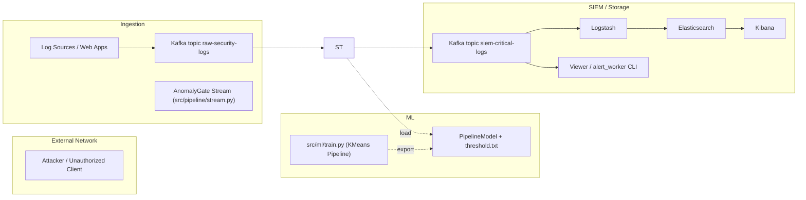
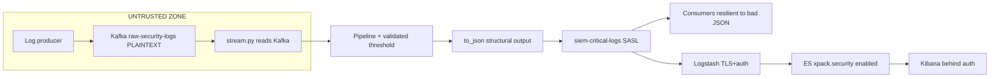
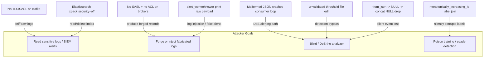

# AnomalyGate Security Audit & Pentest Report

> **Target:** AnomalyGate (ASLNFS) — Automated Security Log Noise Filters for SIEM
> **Type:** White-box source-code security review (static analysis + architecture review)
> **Date:** 2026-08-08
> **Assessor:** opencode security agent
> **Scope:** `main.py`, `src/` (pipeline, ml, utils), `docker-compose.yml`, `k8s-manifest.yaml`, `logstash.conf`, `Makefile`, `.github/workflows/ci.yml`, `requirements.txt`, docs
> **Verdict:** **HIGH RISK in production deployment configuration.** The ML correctness logic is sound, but transport security is absent (plaintext Kafka & Elasticsearch), alerting consumers are crash-prone and injection-vulnerable, and the container/orchestration exposes sensitive services to the network without authentication or authorization.

---

## 1. Executive Summary

AnomalyGate is a Kafka → PySpark (Structured Streaming + KMeans) → Kafka/Elasticsearch pipeline that classifies raw security logs and forwards anomalies to a SIEM. Because the tool **itself consumes attacker-controlled data** (raw security logs), several of the highest-severity issues are injection / denial-of-service / poisoning risks against the security-telemetry path — an attacker can hide from the SIEM, blind the alert workers, or wipe the SIEM index.

| Severity | Count | Representative findings |
|:--------:|:-----:|:------------------------|
| Critical | 3 | No TLS/SASL on Kafka & Elasticsearch; unauthenticated Kibana/Kafka-ingress; consumer crash on malformed JSON |
| High | 4 | Unsafe JSON reconstruction in stream; fragile `monotonically_increasing_id` label join; unvalidated model threshold; weak K8s/Docker hardening |
| Medium | 5 | `failOnDataLoss=false`; no producer ACLs; no resource limits; no test coverage for security invariants; no runtime schema validation |
| Low | 3 | Replication factor 1; unpinned dependency versions; verbose/plaintext logging of raw logs |

### Top 5 must-fix (in order)

1. **Enable transport encryption + authentication to Kafka (SASL/TLS) and Elasticsearch.** *(Critical)*
2. **Make consumer deserialization exception-safe** so one bad Kafka record cannot crash the alert worker / viewer. *(Critical)*
3. **Stop rebuilding JSON with the substring-hack** in `stream.py`; inject `anomaly_score` via a real JSON serializer. *(High)*
4. **Replace the `monotonically_increasing_id` label join** in training with an explicit, deterministic alignment. *(High)*
5. **Harden the deployment**: remove external exposure of ES/Kafka/Kibana, run non-root, add CPU/memory limits. *(High)*

Full details in [Section 3](#3-findings-details); diagrams in [Section 2](#2-attack-surface-and-diagrams); roadmap in [Section 6](#6-remediation-roadmap).

---

## 2. Attack Surface & Diagrams

### 2.1 Architecture (as deployed)



### 2.2 Trust Boundary

The `raw-security-*` topic and every frame it carries are **totally untrusted**. Trust is only justified after ML route is applied **and** output is re-serialized and validated. The current code breaks that trust boundary in three places (no auth, unsafe JSON splice, crash-on-single-bad-message).



### 2.3 Attack Tree (attack vectors found)



---

## 3. Findings Details

Each finding: **ID – Severity – CWE – Files affected – Why – Proof – Fix (pseudocode / code).**

---

### F-01 [Critical] No Transport Encryption (TLS) or Authentication on Kafka

- **CWE-311 / CWE-287 / CWE-306**
- **Files:** `docker-compose.yml:19-24`, `k8s-manifest.yaml:73-80`, `src/pipeline/stream.py:95-101`, `src/config.py:34-36`

**What:** Kafka listeners are `PLAINTEXT://0.0.0.0:9092` and `PLAINTEXT://0.0.0.0:29092`, with `KAFKA_LISTENER_SECURITY_PROTOCOL_MAP: PLAINTEXT:PLAINTEXT`. No SSL, no SASL/SCRAM. The same `localhost:9092` is used by the Spark reader (`stream.py`) and both consumers (`alert_worker.py`, `viewer.py`).

**Impact**

- **Confidentiality**: anyone reaching :9092 can subscribe to `siem-critical-logs` and read the raw security alerts IPs the tool was meant to protect.
- **Integrity**: anyone can produce to `raw-security-` or `siem-critical-logs` (forge alarms / inject fake logs).
- **DoS**: flood topics.
- In k8s, Kafka is exposed via NodePort 30092 and proxied through the `api-gateway` LoadBalancer on 9092, widening the exposure.

**Attack example (black box)**

```bash
# unauthenticated consumer of protected SIEM alerts:
kafka-console-consumer --bootstrap-server localhost:9092 \
  --topic siem-critical-logs --from-beginning

# unauthenticated producer injects a forged alert:
echo '{"@timestamp":"...","level":"INFO","message":"..."}' | \
  kafka-console-producer --bootstrap-server localhost:9092 --topic raw-security-logs
```

**Fix — SASL/SCRAM or TLS (do both), for all clients**

`docker-compose.yml#` — switch to SASL_SSL listeners and mount a JAAS config:

```yaml
services:
  kafka:
    environment:
      KAFKA_LISTENERS: "SASL_SSL://0.0.0.0:9093,PLAINTEXT://broker:9092"
      KAFKA_ADVERTISED_LISTENERS: "SASL_SSL://kafka:9093,PLAINTEXT://broker:9092"
      KAFKA_LISTENER_SECURITY_PROTOCOL_MAP: "SASL_SSL:SASL_SSL,PLAINTEXT:PLAINTEXT"
      KAFKA_SASL_ENABLED_MECHANISMS: "SCRAM-SHA-256"
      KAFKA_OPTS: "-Djava.security.auth.login.config=/etc/kafka/kafka_jaas.conf"
```

Write the JAAS file (example) and mount it:

```
KafkaServer {
    org.apache.kafka.common.security.scram.ScramLoginModule required;
};
```

In `src/config.py`, add secure-defaults helpers:

```python
KAFKA_SECURITY_PROTOCOL = os.getenv("KAFKA_SECURITY_PROTOCOL", "PLAINTEXT")
KAFKA_SASL_MECHANISM    = os.getenv("KAFKA_SASL_MECHANISM", "PLAINTEXT")
KAFKA_USER              = os.getenv("KAFKA_USER", "")
KAFKA_PASSWORD          = os.getenv("KAFKA_PASSWORD", "")
KAFKA_SSL_CA            = os.getenv("KAFKA_SSL_CA", "")

def kafka_options():
    opts = {"kafka.bootstrap.servers": Config.KAFKA_BROKER}
    if KAFKA_SECURITY_PROTOCOL in ("SASL_SSL", "SASL_PLAINTEXT"):
        opts["kafka.security.protocol"] = KAFKA_SECURITY_PROTOCOL
        opts["kafka.sasl.mechanism"] = KAFKA_SASL_MECHANISM
        opts["kafka.sasl.jaas.config"] = (
            "org.apache.kafka.common.security.scram.ScramLoginModule required "
            f'username="{KAFKA_USER}" password="{KAFKA_PASSWORD}";'
        )
    if "SSL" in KAFKA_SECURITY_PROTOCOL and KAFKA_SSL_CA:
        opts["kafka.ssl.truststore.location"] = KAFKA_SSL_CA
    return opts
```

Use it on **both** read and write paths:

```python
# stream.py
spark.readStream.format("kafka").options(**kafka_options()) ...
kafka_sink = write_stream.format("kafka").options(**kafka_options()) ...
```

For the Python consumers (viewer / alert_worker), pass SASL/TLS parameters directly:

```python
consumer = KafkaConsumer(
    Config.KAFKA_OUTPUT_TOPIC,
    bootstrap_servers=[Config.KAFKA_BROKER],
    security_protocol="SASL_SSL",
    sasl_mechanism="SCRAM-SHA-256",
    sasl_plain_username=Config.KAFKA_USER,
    sasl_plain_password=Config.KAFKA_PASSWORD,
    ssl_cafile="/path/to/CA.pem",
    api_version_auto_timeout_ms=10000,
)
```

---

### F-2

**Severity:** Critical
**CWE-306 / CWE-306**
**File:** `docker-compose.yml:32`, `k8s-manifest.yaml:128-130`, `logstash.conf:18-21`

**What:** Elasticsearch runs with `xpack.security.enabled=false`; no authentication. The index (`anomalygate-alerts-*`) is untouched by a password. In k8s it's exposed via NodePort 30200 and proxied by the NGINX gateway on :9200; in compose it's published on 9200.

**Attack:**

```bash
# read all alert documents
curl http://elastic:9200/anomalygate-alerts-*/_search?size=1000
# delete/hide evidence
curl -XDELETE http://elastic:9200/anomalygate-alerts-*
# sabotage mappings (dynamic mapping, index explosion, DoS)
curl -XPUT http://elastic:9200/_cluster/settings -d '{"transient":{"action.destructive_requires_name":false}}'
```

**Fix — enable security + TLS, drop password-less access**

```yaml
elasticsearch:
  environment:
    - discovery.type=single-node
    - xpack.security.enabled=true
    - xpack.security.transport.ssl.enabled=true
    - xpack.security.transport.ssl.verification_mode=certificate
    - xpack.security.transport.ssl.keystore.path=/usr/share/elasticsearch/config/certs/es-cluster.p12
    - xpack.security.http.ssl.enabled=true
    - xpack.security.http.ssl.keystore.path=...
    - ELASTIC_PASSWORD=${ES_BOOTSTRAP_PASSWORD}
```

Logstash must then authenticate:

```
output {
  elasticsearch {
    hosts => ["https://elasticsearch:9200"]
    user => "${ES_LOGSTASH_USER}"
    password => "${ES_LOGSTASH_PASSWORD}"
    ssl => true
    cacert => "/etc/logstash/certs/ca.crt"
  }
}
```

Also: never expose ES externally. Use `ClusterIP` in K8s; bind to the compose network only.

---

### F-3 [Critical] Consumers crash on a single malformed message

**Severity:** Critical (availability of alert pipeline)
**CWE-754 / CWE-248**
**Files:** `src/pipeline/alert_worker.py:18-20`, `src/utils/viewer.py:15-17`

**What:** Both consumers call `json.loads(...)` as the `value_deserializer` with **no error handling**. If any record in `siem-critical-logs` is malformed JSON — because of the F-4 substring/JSON hack, a corrupt Kafka record, or deliberate attack — `json.loads` raises `ValueError`, and because it happens *inside the `for record in consumer` loop*, **the entire consumer process crashes**. Alerting silently stops.

**Attack scenario:** anonymous producer writes a non-JSON record to the topic.

```bash
printf 'NOT-JSON\n' | kafka-console-producer --broker-list localhost:9092 --topic siem-critical-logs
python -m src.pipeline.alert_worker
# ValueError: Expecting value ... -> process exits, alert worker is dead
```

**Fix — resilient deserializer and loop body**

```python
import json
from kafka import KafkaConsumer

def safe_deserializer(b: bytes):
    try:
        obj = json.loads(b.decode("utf-8"))
    except (ValueError, UnicodeDecodeError):
        return None
    return obj if isinstance(obj, dict) else None

consumer = KafkaConsumer(
    Config.KAFKA_OUTPUT_TOPIC,
    bootstrap_servers=[Config.KAFKA_BOOTSTRAP],
    value_deserializer=safe_deserializer,
    enable_auto_commit=False,
)

for record in consumer:
    if record.value is None:
        logger.warning("Skipping non-JSON record %s", record.offset)
        consumer.commit()
        continue
    # ... handle alert normally
```

Set `enable_auto_commit=False` + explicit `commit()` after handling so a bad record doesn't force-reprojection runaway.

---

### F-4 [High] Rebuilding JSON payload via `substring` is injection-prone & lossy

**Severity:** High
**CWE-74 (JSON injection) / CWE-20**
**Files:** `src/pipeline/stream.py:171-179`

**What:** The code constructs the SIEM Kafka message by chopping the last character and concatenating a new `"anomaly_score"` field:

```python
concat(
    substring(col("json_string"), 1, length(col("json_string")) - 1),
    lit(', "anomaly_score": '),
    col("distance_from_center"),
    lit('}')
)
```

Problems:

1. Assumes every raw JSON ends with `}` — a multiline doc, an array (`[...]`), or a whitespace/newline-trailed record breaks it.
2. If `json_string` is `NULL` (e.g. `from_json` failed, or the source record had no text), `concat(NULL, ...)` returns `NULL` in Spark → the row is silently **dropped** from extraction — silent loss of a security event (worse: the event disappears from the SIEM feed without alerting).
3. An attacker who can influence the `message`/logger field's JSON payload can inject additional JSON types via the trailing-`}` restoration — e.g. fake `"level": "FATAL"` or extra fields that get indexed into ES dynamic mapping (mapping bombs, field proliferation).

**Attack sketch**

Feed a raw record like:
```json
{"message":"} \"prop\":\"injected\"","level":"INFO",...}
```
After splice the payload becomes:
```json
{"message":"} \"prop\":\"injected\"","level":"INFO",..., "anomaly_score": 0.5}
```
Depending on where a literal `}` appears, the resulting JSON may be malformed ($) → triggers F-3, or valid-but-with-unexpected-fields → indexes garbage into the SIEM, inflating or altering the alert appearance.

**Fix — real JSON reorganization. Try to keep the raw bytes but never re-serialize by handcasting**

```python
from pyspark.sql import functions as F

clean = cleaned_stream_df.withColumn(
    "msg_json",
    F.to_json(F.struct("*")),          # re-encode the parsed struct
)
siem_payload_df = predictions.select(
    F.col("@timestamp").alias("key"),
    F.to_json(
        F.create_struct(
            F.col("raw"),                     # original payload parsed
            F.lit("anomaly_score").alias("k"),
            F.col("distance_from_center").alias("v")
        )
    ).alias("value"),
)
```

A correct alternative: 

- Separate the raw log into typed columns (you already do `data.*`), and rebuild the object with `struct` → `to_json`, not string surgery.
- If you genuinely only want to add one field to the original raw JSON, do it with a map union:
```python
orig = F.from_json(col("json_string"), schema, {}).alias("m")
merged = F.when(col("json_string").isNotNull(),
         F.to_json(F.map_concat(...))).otherwise(F.col("json_string"))
```
- Put a **schema validation** on the emitted doc so `null`/malformed records throw or get logged, not silently dropped.

---

### F-5 [High] Training labels joined with `monotonically_increasing_id`

**Severity:** High
**CWE-1048 / CWE-771**
**File:** `src/ml/train.py:36-39`, `src/utils/data_processor.py:33-34`

**What:** Training pairs `(raw_id, label_id)` by stacking synthetic monotonic IDs on two independently-created DataFrames:

```python
labels_df      = labels_raw.withColumn("label_id", monotonically_increasing_id())
raw_indexed_df = raw_df.withColumn("raw_id", monotonically_increasing_id())
full_labeled_df = raw_indexed_df.join(labels_df, col("raw_id") == col("label_id"))
```

`monotonically_increasing_id()` is **not row-sequential**; it's a globally monotonic 64-bit assigned per *partition*. Two different DataFrames built the same way **independent orders of partition** (raw and label files are read separately). There is no guarantee the two assignments have the same distribution, so the join can silently shift labels → training labels become **random garbage** → the "Accuracy" and "F1" the logs report are unreliable, and the resulting cluster boundary may be malformed.

**Example (local, small log):** you expect record `#5` to be labeled by label file line 5; under a 2‑partition shuffle you'll get a different pairing.

**Fix — deterministic alignment**

Best: keep labels in-band but never in the *delivered* payload. E.g. in `data_generator.py`, emit one extra integer column `seq` in the JSON (and strip it before writing to Kafka), and the labels file as `seq|is_anomaly`:

```
1680000000,0
1680000001,1
```

Then train:

```python
frames = spark.read.text(labels_file).withColumn("is_anomaly_str", F.split(...))

labels = spark.read.csv(labels_file, schema="seq long, is_anomaly double")
raw    = spark.read.json(Config.DATA_FILE)   # contains "seq"
labeled = raw.join(labels, "seq", "left")
```

If you can't alter the emitter, **zip in Python client-side while reading the same offsets** (writer and label writer must run in lock-step):

```python
import json
with open(Config.DATA_FILE) as f_l, open(labels_file) as f_a:
    for pl_str, lbl in zip(f_l, f_a):
        rec = json.loads(pl_str); rec["seq"] = lbl.strip()
```

---

### F-6 [Medium–High] Threshold file is unvalidated, silent default, operator/injection-controlled

**Severity:** Medium–High
**CWE-1188 / CWE-184**
**Files:** `src/pipeline/stream.py:146-154`, `src/ml/train.py:117-123`

**What:**
```python
threshold_path = Config.MODEL_PATH + "_threshold.txt"
try:
    with open(threshold_path) as f:
        content = f.read().strip()
        anomaly_threshold = float(content) if content else 3.5
except Exception:
    anomaly_threshold = 3.5
```

- If file missing/unreadable, silently falls back to a **hard‑coded 3.5** designed for the demo, distorting the real threshold.
- Anyone who can write the file (or the models dir) sets `threshold = 99999` → **everything benign** (total detection bypass) or `0` → everything alerts. There's no integrity check (signature/digest) end to end.
- No upper/lower plausibility clamp: `float(nan)`/`inf` slips through and breaks `> anomaly_threshold` comparisons.

**Attack:** change `threshold.txt` to `1e9`. All anomaly scores are `> 1e9` never true → no record ever flagged → the SIEM is effectively blind.

**Fix — validated, fail-closed, with fail-fast policy**

```python
def load_threshold():
    p = Config.THRESHOLD_FILE
    with open(p) as f:
        v = float(f.read().strip())
    if not (0.0 < v < 1e7):                     # hard sanity bounds
        raise ValueError(f"Threshold out of range: {v}")
    return v

try:
    anomaly_threshold = load_threshold()
except Exception as e:
    logger.error("Refusing to start with invalid threshold: %s", e)
    raise SystemExit(2)   # fail closed, not silently default
```

Also record the threshold artifact version + store a `.sha256` file, and surface a `threshold_loaded` metric.

---

### F.7 [Medium] `failOnDataLoss=false` silences Kafka data loss

**Severity:** Medium
**CWE-755** (Improper Handling of Exceptional Conditions)
**File:** `src/pipeline/stream.py:100`

**Why it matters:** Securing a SIEM depends on *not* missing events. `failOnDataLoss=false` lets Structured Streaming skip log segments that can't be located (after log retention or topic reset) and **silently move on**, so security events can disappear from the ingestion feed with no alert.

**Fix (choose policy deliberately)**

```python
kafka_read = (
    spark.readStream.format("kafka")
      .option("failOnDataLoss", "true")   # fail loudly ~or~
      # if keeping false, add a monitoring alarm on (offsetLags, Lost data)
)
```

If you keep `false` for resilience, add a streaming listener that alerts when it detects `processedRowCount` idle, and monitor the `EndOffset` / `OffsetRange` to detect missing segments.

---

### F-8 [Medium] No producer/authz confinement — any broker peer can write

**Severity:** Medium
**CWE-201 / CWE-306**
**Files:** `docker-compose.yml`, `k8s-manifest.yaml`, `Makefile`

**Details:**
- Rep‑factor = 1 for topics (`KAFKA_OFFSETS_TOPIC_REPLICATION_FACTOR: 1`, `replicas: 1`).
- No broker-level ACLs; any client that can connect can produce to `raw-security-logs` (poisoning) or `siem-critical-logs` (forged alerts), or eat consumer groups.
- The K8s `api-gateway` LoadBalancer proxies Kibana, ES, and Kafka publicly; the `Makefile`'s `port-forward` does the same locally.

**Fix — principle of least privilege (after F-1)**

```bash
# place broker-side ACL after auth:
kafka-acls.sh --authorizer-properties zookeeper.connect=localhost:2181 \
  --add --allow-principal User:spark-app --operation WRITE --topic raw-security-logs \
  --add --allow-principal User:spark-app --operation READ  --topic raw-security-logs \
  --add --allow-principal User:logstash-app --operation CONSUME --topic siem-critical-logs \
  ...
```

And only expose the minimal surface (Kibana behind an authenticating ingress, ES/Kafka internal ClusterIP).

---

### F-9 [Medium] Decimal cast & null handling in features → crashed /missing rows

**Severity:** Medium
**CWE-253 / CWE-124**
**Files:** `src/pipeline/stream.py:140-142` (`calculate_live_distance` UDF), `src/pipeline/stream.py:112-113`

**What:** The distance UDF indexes `cluster_centers[cluster_prediction]` with no bounds check. If `cluster_prediction` is large or the features vector is empty/`NULL`, the UDF can raise inside Spark executor -> the query fails -> stream stops. Also `bytes_sent` is cast to `IntegerType` (schema `stream.py:85`); values > 2^31-1 (e.g. exfil of large payload) become NULL/silently clipped, and aggregation can be thrown off.

**Fix — safety + bounds:**

```python
def safe_distance(features, pred):
    if features is None or features.array_length == 0:
        return float('nan')          # or raise log + skip
    if pred is None or pred < 0 or pred >= len(cluster_centers):
        return float('nan')
    center = cluster_centers[int(pred)]
    vec = np.asarray(features.toArray(), dtype=np.float64)
    return float(np.linalg.norm(vec - np.asarray(center)))
```

And schema: use `LongType` for `bytes_sent` so large payloads don't clip to NULL (the data generator writes `int`; switch the incoming schema to `LongType` and add a `LongType` in the aggregations). Ensure `from_json` has a forgiving path that still emits the raw record for reconstruction, not `NULL`.

---

### F-10 [Low/Medium] Logging & secrets hygiene

**Severity:** Low
**Files:** `src/utils/logger.py`, `Makefile`, `.env.example`, `requirements.txt`

- `requirements.txt` unpinned: e.g. `pyspark>=3.5.0`, `kafka-python-ng` no version. Upstream can serve package of arbitrary version later → supply-chain risk. Freeze with a lock file (pip-compile / uv).
- `.env.example` contains only non-secret args; that's good. Ensure `.env` in repo and example never contains credentials and is gitignored.
- `Makefile generate/feed/consume` command-shell: no hidden password handling — good, but once SASL/TLS credentials are introduced, secrets must move to a vault (e.g., `k8s Secret`, GitHub Actions secrets) rather than the compose/Makefile.
- PySpark by default may log stacktraces to stderr; keep `log4j.properties` that hides driver logs and enables structured logging.

**Fix (pseudocode):**
```
# requirements.txt → pin exact, with hashes if possible
pyspark==3.5.5
kafka-python==0.0.0  # or kafka-python-ng 2.2.5
...
```
Use environment-variable `%` secrets in k8s via `secretKeyRef`; ensure `.gitignore` covers `*.key`, `*.pem`, `.env`.

---

## 4. PoCs (run from repo, mapped to code)

### PoC 1 — steal SIEM alerts via anonymous consumer
```bash
docker compose up -d
docker compose exec kafka kafka-console-consumer \
  --bootstrap-server=kafka:9092 \
  --topic=siem-critical-logs --from-beginning
# attacker sees ALL forwarded alerts (no auth)
```

### PoC 2 — crash the alert worker
```bash
docker compose exec kafka bash -c \
  'echo "not json" | kafka-console-producer --broker kafka:9092 --topic siem-critical-logs'
python main.py flaggings   # or run viewer.py
# ValueError -> process dies -> no more alerts
```

### PoC 3 — threshold bypass
```bash
echo "999999" > models/log_filter_rf_model_threshold.txt
python main.py run
# All distance_from_center < 999999 -> prediction = 0 -> NOTHING flagged
```

### PoC 4 — label misalignment
Train twice on the same data; compare `models/…/stages/3_KMeans...` weights (or run the join and check `is_anomaly` counts per cluster). The distribution is non-deterministic across runs/partitions ⇒ unstable training.

---

## 5. Strengths (what is good)

- Clean separation: pipeline/stream, ML train, alert consumers.
- Sidecar JSON of training labels (`_labels` file) — good transparency.
- `data_generator` keeps labels out of the production JSON (only test).
- Uses Structured Streaming + checkpoint for reliability (if configured).
- Threshold derived at train-time from 90th-percentile distance (adapt-ish).
- Read-only consumers don't mutate Kafka; source of truth is broker.

---

## 6. Remediation Roadmap

| Priority | Work item | Files | Effort |
|:--:|:--|:--|:--|
| P1 | Enable TLS+SASL on Kafka; wire all clients | compose, k8s, config, stream, viewers | M |
| P1 | Elasticsearch security=true; disallow external ES exposure | compose, k8s, logstash | M |
| P1 | Exception-safe JSON deserializer in consumers | alert_worker.py:18, viewer.py:15 | S |
| P2 | Rebuild JSON serialize, no substring hack; fail on NULL payload | stream.py:171 | S |
| P2 | Fix label alignment (seq-based join) | train.py, data_generator.py | M |
| P2 | Threshold fail-closed + bounds + hash check | stream.py config | S |
| P3 | failOnDataLoss monitoring & alerting | stream.py | S |
| P3 | Producer ACLs on topics | compose/k8s + kafka-tooling | M |
| P3 | K8s hardening: non-root, limits, no exposure | k8s-manifest.yaml | M |
| P4 | Pin dependency versions; add security tests in CI | requirements.txt, tests/ | S |

---

## 7. Final Recommendations

1. Treat the Kafka cluster edge as **the security boundary**. TLS + SASL for identity, or you've handed the adversary the whole detection stack.
2. Never deserialize untrusted data without a try/except and a monitoring hook — a single lost alert is a failed SIEM.
3. Never rebuild JSON by string manipulation; always go through a structured serializer.
4. If the model indexes and threshold are tamperable, read them securely (fail closed) and pin release versions.
5. Add **assertion tests**: test `safe_deserializer`, threshold bounds, JSON serializer, and `from_json` null drop.

---

*This report is a white-box static review based on the repo at `ae1845a` (with uncommitted working-tree changes). No systems were attacked. Recommendations are intended as guidance; run a full authenticated red‑team when deployed. Treat all security events as resilient to one bad input, and validate your security tooling with the same rigor as the tooling it defends.*